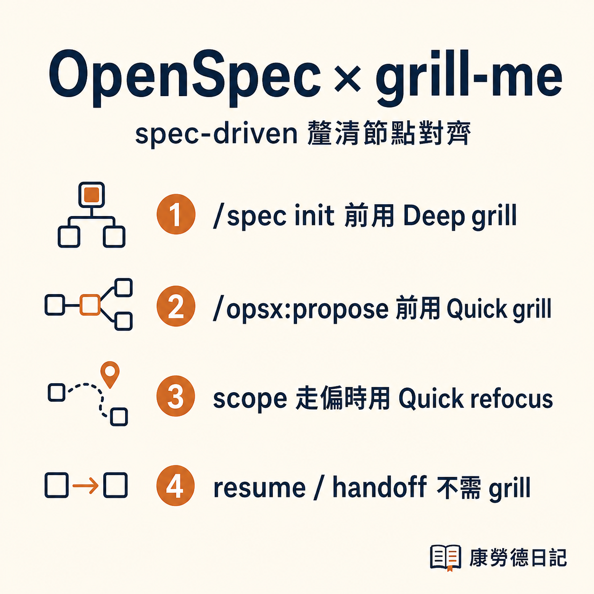
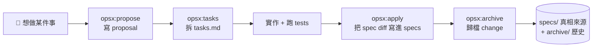
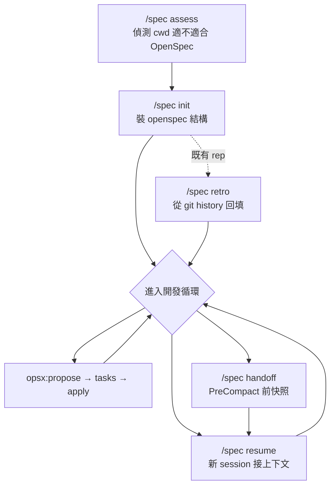
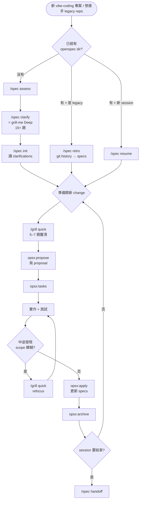

# OpenSpec × grill-me 工作流整合筆記

> 把 spec-driven development 的釐清節點，跟 grill-me 兩個粒度對齊起來。
> Personal workflow notes — **not affiliated with OpenSpec authors**.



## TL;DR

[OpenSpec](https://github.com/Fission-AI/OpenSpec) 這類 spec-driven development 工具假設你已經知道要 propose 什麼。實際開發中（特別是 vibe-coding / 自由開發場景）最常卡的反而是 propose 之前的概念釐清。

把 grill-me 的兩個粒度對齊到 OpenSpec 的兩個生命週期節點，能填補這個 gap：

- **`/spec init` 之前用 Deep grill**（15+ 題, ~20 min）→ 輸出寫進 `project-clarifications.md`，init 啟動會讀
- **`opsx:propose` 之前用 Quick grill**（5–7 題, ~5 min）→ 把模糊 change 概念逼出可寫 spec 的形狀

互動版（含 syntax highlighting + 細節）：[`index.html`](index.html) — 部署版見 [GitHub Pages](https://fireman333.github.io/openspec-grill-me-workflow/)。

**Skill source** (MIT 授權，獨立於本筆記)：兩個 skill 的實際 SKILL.md + dependencies 放在 [`skills/`](skills/) 目錄 — 包含 `/spec` 的完整 lifecycle 模式（assess / init / clarify / retro / resume / handoff / note / clear）與 `/grill-me` 的 5 個 facet pack。⚠️ 內含個人 setup 的 cross-skill 引用，**read [skills/README.md](skills/README.md) 的 disclaimer 再決定要 fork 還是 study-only**。

---

## 1. OpenSpec 原生開發循環

OpenSpec 把每個 feature / 重構 / 變更包成一個 **change proposal**，走四段：



底層由 `openspec` CLI + `opsx:*` plugin 命令提供。

**痛點**：預設假設「你已經知道要 propose 什麼」。Vibe-coding 場景最常卡住的是 propose 之前的概念釐清，以及跨 session 的 context 丟失。

---

## 2. `/spec` 5 個 gate 套在外面

`/spec` 是個 cross-session wrapper skill，補的是 lifecycle 邊界（init / resume / handoff）跟歷史回填（retro），不重複實作 propose / apply / archive：



5 個 gate：assess / init / retro / resume / handoff。

---

## 3. grill-me 兩個切入點

`grill-me` 是個結構化問題拷問 skill，有兩個粒度：

### 切入點 A：`/spec init` **之前** — Deep grill

`/spec clarify` 就是 grill-me 的 thin wrapper：強制 **Deep 模式 + software-project facet pack**，輸出寫到 `openspec/project-clarifications.md`，`/spec init` 啟動時讀進來當 project context。

15+ 題 recursive，~15–30 min。覆蓋 problem statement、users、scope boundary、non-goals、success criteria、constraints、prior art、risks。

### 切入點 B：`opsx:propose` **之前** — Quick grill

每要開一個 change proposal 之前先 grill 一輪，把模糊概念逼出可寫 spec 的形狀。

5–7 題 ~5 min。聚焦在這個 change 的 scope / acceptance criteria / 跟既有 spec 的衝突。

---

## 4. 合體後的完整工作流



---

## 5. Gate × Grill 對照表

| 時機 | 命令 | grill 形態 | 產出 | 跳過條件 |
|---|---|---|---|---|
| 新專案 / 第一次裝 openspec | `/spec init` 前 | Deep | `openspec/project-clarifications.md` | 純 fork、概念已成熟有寫好的 PRD |
| 每次開新 change | `opsx:propose` 前 | Quick | scope / acceptance criteria 草稿 | One-line bugfix、純 rename / dep bump |
| 實作中 scope drift | code 階段 | Quick | refocused tasks.md / 砍 / 拆 change | 明確只是技術細節 trade-off，跟 spec 無關 |
| 跨 session 接手 | `/spec resume` | 通常不用 | — | resume 自己會讀 clarifications + active changes |
| Session 結束 | `/spec handoff` | 不用 | — | handoff 是快照不是釐清 |
| Legacy repo retro | `/spec retro` | 可選 Quick | retro 完發現 spec 缺什麼，再補 grill | git history 已經夠清楚 |

---

## 6. 命令 sequence（複製即用）

### 場景 A：從零開新專案

```bash
cd ~/projects/my-new-app/
/spec assess              # 確認適合 openspec
/spec clarify             # ← Deep grill，~20 min，產出 clarifications.md
/spec init                # 讀 clarifications，建 openspec/ 結構

# 開第一個 change
/grill quick              # ← 5 min 釐清這次要做什麼
/opsx:propose user-auth   # 寫 proposal
/opsx:tasks               # 拆 tasks.md
# ... 實作 ...
/opsx:apply               # 更新 specs/
/opsx:archive             # 歸檔
```

### 場景 B：legacy repo 接手

```bash
cd ~/projects/legacy-app/
/spec assess
/spec init
/spec retro               # 從 git history 回填現有 specs/
# 之後同場景 A 的「開新 change」段
```

### 場景 C：新 session 接續

```bash
cd ~/projects/my-new-app/
/spec resume              # 自動讀 clarifications + active changes + last handoff
# 直接進「開新 change」段
```

---

## 7. 為什麼這樣切

- **grill-me Deep 跟 OpenSpec project context 是同一件事**：兩邊都在問「這專案要幹嘛、給誰用、邊界在哪、success 怎麼定義」。直接讓 grill 輸出餵給 init，不重複問。
- **grill-me Quick 跟 OpenSpec change proposal 是同一個顆粒度**：一個 change = 一個 PR-sized 的範圍變動，5–7 題剛好。寫 proposal 之前 grill，比寫到一半發現 scope 不對再砍掉便宜。
- **plan-phase hard rule 自然觸發**：「想做 X」「規劃 Y」這種訊號出現 → propose `/grill quick` 等回應 → grill 完寫 propose，整條鏈就是 spec-driven 的正規流程。
- **不要在 resume / handoff 加 grill**：那兩個 gate 是 lifecycle 機制不是釐清節點，硬加會讓接手變慢。

---

## License & Attribution

Content licensed under [CC-BY-4.0](LICENSE) — feel free to share / adapt / build upon, with attribution.

### Third-party references

- **OpenSpec** — independent open-source spec-driven development project. This repo describes a **personal integration workflow** and is **not affiliated with the OpenSpec authors**. Concepts (`propose` / `apply` / `archive` lifecycle) used per public documentation. Upstream: [github.com/Fission-AI/OpenSpec](https://github.com/Fission-AI/OpenSpec)
- **Mermaid** — diagrams rendered with [Mermaid](https://mermaid.js.org/) (MIT license)
- **Hero image** generated with [OpenAI Codex CLI](https://github.com/openai/codex) / `gpt-image-2` (2026-05-16). Per OpenAI terms, generated images are owned by the user.

### Personal Claude Code skills (not bundled)

`/spec` and `/grill-me` referenced in this workflow are personal [Claude Code](https://claude.com/claude-code) skill wrappers (Claude Code's user-defined automation, stored locally per user). This repo describes only the conceptual integration — the skills' source code is not published here.

---

Generated 2026-05-16 by [康瑋麟 (fireman333)](https://github.com/fireman333).
